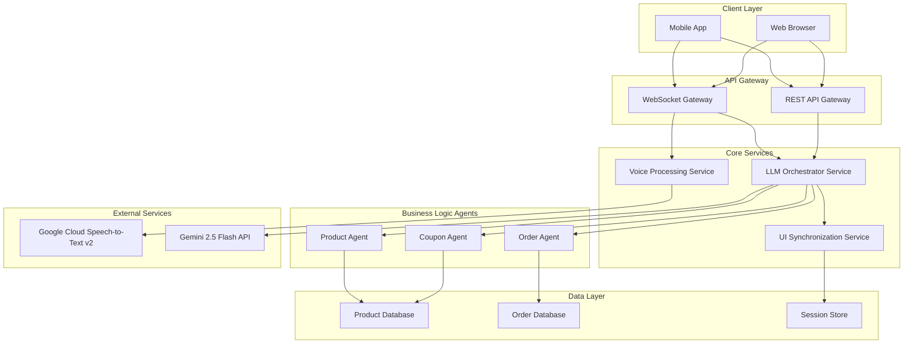

# Design Document

## Overview

This document outlines the design for a mobile voice ordering system that integrates Google Cloud Speech-to-Text v2 streaming recognition with Gemini 2.5 Flash LLM. The system provides a real-time, conversational ordering experience through intelligent agent orchestration, supporting both voice and text inputs with synchronized UI updates and mock payment processing.

The architecture follows a microservices approach with clear separation of concerns between voice processing, LLM orchestration, business logic agents, and UI synchronization. The system is designed to handle Korean language interactions while maintaining extensibility for other languages.

## Architecture

### High-Level Architecture



### Service Communication Pattern

The system uses a hybrid communication pattern:
- **WebSocket connections** for real-time voice streaming and UI updates
- **REST APIs** for stateless operations and configuration
- **Event-driven messaging** for inter-service communication
- **Function calling** for LLM-to-service integration

## Components and Interfaces

### 1. Voice Processing Service

**Responsibilities:**
- Manage Google Cloud Speech-to-Text v2 streaming connections
- Handle audio format conversion and validation
- Provide partial and final transcription results
- Manage voice activity detection and interruption handling

**Key Interfaces:**
```typescript
interface VoiceProcessingService {
  startAudioStream(sessionId: string, config: AudioConfig): Promise<StreamConnection>
  stopAudioStream(sessionId: string): Promise<void>
  processAudioChunk(sessionId: string, audioData: ArrayBuffer): Promise<void>
  setLanguage(sessionId: string, languageCode: string): Promise<void>
  getDevicePermissions(): Promise<MediaPermissions>
}

interface AudioConfig {
  sampleRate: number // 16000 Hz required
  channels: number   // 1 (mono) required
  encoding: 'PCM_16' // 16-bit PCM required
  languageCode: string // 'ko-KR' default
  enablePartialResults: boolean
  enableVoiceActivityDetection: boolean
}

interface TranscriptionResult {
  sessionId: string
  text: string
  confidence: number
  isFinal: boolean
  timestamp: number
  alternatives?: string[]
}
```

### 2. LLM Orchestrator Service

**Responsibilities:**
- Manage Gemini 2.5 Flash API connections and streaming
- Route requests to appropriate business logic agents
- Handle function calling and tool integration
- Coordinate multi-turn conversations and context management

**Key Interfaces:**
```typescript
interface LLMOrchestratorService {
  processUserInput(sessionId: string, input: UserInput): Promise<void>
  routeToAgent(sessionId: string, intent: Intent, context: ConversationContext): Promise<AgentResponse>
  handleFunctionCall(sessionId: string, functionCall: FunctionCall): Promise<FunctionResponse>
  updateConversationContext(sessionId: string, context: ConversationContext): Promise<void>
}

interface UserInput {
  type: 'voice' | 'text'
  content: string
  timestamp: number
  metadata?: Record<string, any>
}

interface Intent {
  category: 'product' | 'coupon' | 'order' | 'general'
  action: string
  confidence: number
  slots: Record<string, any>
}

interface FunctionCall {
  name: string
  parameters: Record<string, any>
  id: string
}
```

### 3. Business Logic Agents

#### Product Agent
**Responsibilities:**
- Handle product search, catalog browsing, and inventory management
- Process product-related queries and recommendations
- Manage cart operations and product validation

**Function Declarations:**
```typescript
interface ProductAgentFunctions {
  search_catalog(query: string, filters?: ProductFilters): Promise<ProductSearchResult>
  get_product(productId: string): Promise<ProductDetails>
  add_to_cart(sessionId: string, productId: string, quantity: number, options?: ProductOptions): Promise<CartUpdate>
  update_inventory(productId: string, delta: number): Promise<InventoryUpdate>
  get_recommendations(sessionId: string, context: RecommendationContext): Promise<ProductRecommendation[]>
}

interface ProductFilters {
  category?: string
  priceRange?: [number, number]
  availability?: boolean
  tags?: string[]
}
```

#### Coupon Agent
**Responsibilities:**
- Validate and apply discount coupons
- Calculate discount amounts and handle coupon rules
- Manage coupon eligibility and stacking policies

**Function Declarations:**
```typescript
interface CouponAgentFunctions {
  validate_coupon(code: string, cartTotal: number, items: CartItem[], userId?: string): Promise<CouponValidation>
  apply_coupon(sessionId: string, couponId: string): Promise<DiscountApplication>
  list_available_coupons(userId?: string, cartContext?: CartContext): Promise<AvailableCoupon[]>
  compute_discount(couponId: string, cart: Cart): Promise<DiscountCalculation>
}

interface CouponValidation {
  isValid: boolean
  couponId?: string
  discountAmount?: number
  discountType: 'percentage' | 'fixed' | 'free_shipping'
  restrictions?: CouponRestriction[]
  errorMessage?: string
}
```

#### Order Agent
**Responsibilities:**
- Manage order creation and processing workflow
- Handle pickup and delivery logistics
- Coordinate mock payment processing and order status updates

**Function Declarations:**
```typescript
interface OrderAgentFunctions {
  create_order(sessionId: string, orderDetails: OrderCreationRequest): Promise<OrderCreated>
  quote_delivery_fee(address: DeliveryAddress, items: CartItem[]): Promise<DeliveryQuote>
  set_order_status(orderId: string, status: OrderStatus, metadata?: OrderStatusMetadata): Promise<OrderUpdate>
  get_pickup_locations(location?: GeoLocation): Promise<PickupLocation[]>
  schedule_pickup(orderId: string, locationId: string, preferredTime: string): Promise<PickupSchedule>
}

interface OrderCreationRequest {
  items: CartItem[]
  orderType: 'pickup' | 'delivery'
  customerInfo: CustomerInfo
  deliveryAddress?: DeliveryAddress
  pickupLocation?: PickupLocation
  specialInstructions?: string
}
```

### 4. Mock Payment Service

**Responsibilities:**
- Simulate payment processing without handling real payment data
- Provide realistic payment flow with configurable success/failure scenarios
- Generate payment session IDs and status transitions

**Key Interfaces:**
```typescript
interface MockPaymentService {
  createPaymentSession(orderId: string, amount: number, currency: string): Promise<PaymentSession>
  getPaymentStatus(sessionId: string): Promise<PaymentStatus>
  simulatePaymentResult(sessionId: string, result: 'success' | 'failure', delay?: number): Promise<void>
  cancelPayment(sessionId: string): Promise<PaymentCancellation>
}

interface PaymentSession {
  sessionId: string
  orderId: string
  amount: number
  currency: string
  status: 'created' | 'pending' | 'processing' | 'completed' | 'failed' | 'cancelled'
  createdAt: Date
  expiresAt: Date
}
```

### 5. UI Synchronization Service

**Responsibilities:**
- Manage UI state synchronization across client applications
- Emit UI update events for different application views
- Handle navigation and loading state management

**Key Interfaces:**
```typescript
interface UISynchronizationService {
  emitUIUpdate(sessionId: string, update: UIUpdate): Promise<void>
  emitToast(sessionId: string, toast: ToastMessage): Promise<void>
  emitNavigation(sessionId: string, navigation: NavigationEvent): Promise<void>
  emitLoader(sessionId: string, loader: LoaderState): Promise<void>
}

interface UIUpdate {
  panel: 'search' | 'product' | 'cart' | 'checkout' | 'order_status'
  view: string
  data: Record<string, any>
  timestamp: number
}

interface ToastMessage {
  kind: 'success' | 'error' | 'warning' | 'info'
  message: string
  duration?: number
}
```

## Data Models

### Core Entities

```typescript
// Product Models
interface Product {
  id: string
  name: string
  description: string
  price: number
  currency: string
  category: string
  imageUrl?: string
  options: ProductOption[]
  inventory: InventoryInfo
  tags: string[]
  isActive: boolean
}

interface ProductOption {
  id: string
  name: string
  type: 'single' | 'multiple'
  required: boolean
  choices: OptionChoice[]
}

interface OptionChoice {
  id: string
  name: string
  priceModifier: number
  isAvailable: boolean
}

// Cart Models
interface Cart {
  sessionId: string
  items: CartItem[]
  subtotal: number
  discounts: AppliedDiscount[]
  taxes: TaxCalculation[]
  total: number
  currency: string
  updatedAt: Date
}

interface CartItem {
  productId: string
  quantity: number
  selectedOptions: Record<string, string>
  unitPrice: number
  totalPrice: number
  addedAt: Date
}

// Order Models
interface Order {
  id: string
  sessionId: string
  customerId?: string
  items: OrderItem[]
  orderType: 'pickup' | 'delivery'
  status: OrderStatus
  paymentStatus: PaymentStatus
  customerInfo: CustomerInfo
  deliveryInfo?: DeliveryInfo
  pickupInfo?: PickupInfo
  pricing: OrderPricing
  timestamps: OrderTimestamps
  specialInstructions?: string
}

interface OrderStatus {
  current: 'created' | 'confirmed' | 'preparing' | 'ready' | 'in_transit' | 'delivered' | 'completed' | 'cancelled'
  history: StatusChange[]
  estimatedCompletion?: Date
}

// Coupon Models
interface Coupon {
  id: string
  code: string
  name: string
  description: string
  discountType: 'percentage' | 'fixed_amount' | 'free_shipping'
  discountValue: number
  minimumOrderAmount?: number
  maximumDiscountAmount?: number
  validFrom: Date
  validUntil: Date
  usageLimit?: number
  usageCount: number
  restrictions: CouponRestriction[]
  isActive: boolean
}

// Session Models
interface ConversationSession {
  sessionId: string
  userId?: string
  currentState: SessionState
  conversationHistory: ConversationTurn[]
  cart: Cart
  currentOrder?: Order
  preferences: UserPreferences
  createdAt: Date
  lastActivity: Date
  expiresAt: Date
}

interface ConversationTurn {
  id: string
  role: 'user' | 'assistant' | 'system'
  content: TurnContent[]
  timestamp: Date
  metadata?: Record<string, any>
}

interface TurnContent {
  type: 'text' | 'audio' | 'function_call' | 'function_response' | 'ui_update'
  data: any
}
```

### State Machine Definition

```typescript
interface SessionState {
  current: SessionStateType
  context: StateContext
  allowedTransitions: SessionStateType[]
}

type SessionStateType = 
  | 'idle'
  | 'listening'
  | 'processing_voice'
  | 'intent_detected'
  | 'slot_filling'
  | 'cart_review'
  | 'checkout_info'
  | 'payment_session_created'
  | 'payment_pending'
  | 'payment_completed'
  | 'payment_failed'
  | 'order_confirmed'
  | 'error'

interface StateContext {
  currentIntent?: Intent
  missingSlots?: string[]
  retryCount: number
  errorMessage?: string
  lastUserInput?: UserInput
  pendingActions?: PendingAction[]
}
```

## Error Handling

### Error Categories and Recovery Strategies

1. **Voice Recognition Errors**
   - Network connectivity issues → Retry with exponential backoff
   - Audio quality problems → Request user to repeat or switch to text
   - Language detection failures → Prompt for language selection

2. **LLM Processing Errors**
   - API rate limits → Queue requests and implement backoff
   - Context length exceeded → Summarize conversation history
   - Function call failures → Retry with corrected parameters

3. **Business Logic Errors**
   - Product not found → Suggest alternatives
   - Inventory insufficient → Offer substitutions or waitlist
   - Coupon invalid → Explain restrictions and suggest alternatives

4. **Payment Processing Errors**
   - Mock payment failure → Offer retry or different payment method
   - Session timeout → Extend session or restart checkout

### Error Response Format

```typescript
interface ErrorResponse {
  errorCode: string
  errorMessage: string
  errorCategory: 'voice' | 'llm' | 'business' | 'payment' | 'system'
  severity: 'low' | 'medium' | 'high' | 'critical'
  recoveryActions: RecoveryAction[]
  userMessage: string
  timestamp: Date
}

interface RecoveryAction {
  type: 'retry' | 'fallback' | 'user_input' | 'restart'
  description: string
  parameters?: Record<string, any>
}
```

## Testing Strategy

### Unit Testing
- **Voice Processing Service**: Mock Google Cloud Speech-to-Text responses
- **LLM Orchestrator**: Mock Gemini API responses and function calls
- **Business Logic Agents**: Test function implementations with various inputs
- **Mock Payment Service**: Verify payment flow state transitions

### Integration Testing
- **End-to-End Voice Flow**: Real audio input through complete order process
- **Multi-Agent Coordination**: Test complex scenarios requiring multiple agents
- **Error Recovery**: Simulate various failure conditions and recovery paths
- **UI Synchronization**: Verify UI updates across different client states

### Performance Testing
- **Voice Latency**: Measure speech-to-text and response generation times
- **Concurrent Sessions**: Test system behavior under multiple simultaneous users
- **Memory Usage**: Monitor conversation context and session storage
- **API Rate Limits**: Test behavior under Google Cloud API constraints

### Demo Testing Scenarios

1. **Happy Path Pickup Order**
   - Voice: "안녕하세요, 아메리카노 두 잔 주문하고 싶어요"
   - Expected: Product search → Cart addition → Store selection → Mock payment → Order confirmation

2. **Happy Path Delivery Order**
   - Voice: "피자 한 판 배달 주문할게요"
   - Expected: Product search → Address collection → Delivery fee calculation → Mock payment → Order tracking

3. **Error Recovery Scenarios**
   - Unclear voice input → Clarification request
   - Product out of stock → Alternative suggestions
   - Invalid coupon → Error explanation and alternatives
   - Payment failure → Retry options

4. **Multi-Language Support**
   - Korean voice commands with English product names
   - Language switching during conversation
   - Proper pronunciation feedback

### Testing Tools and Frameworks

```typescript
// Example test structure
describe('Voice Ordering System', () => {
  describe('Product Agent', () => {
    it('should search products by voice query', async () => {
      const mockTranscription = "아메리카노 찾아줘";
      const result = await productAgent.search_catalog(mockTranscription);
      expect(result.products).toHaveLength(greaterThan(0));
      expect(result.products[0].name).toContain('아메리카노');
    });
  });

  describe('Order Flow Integration', () => {
    it('should complete pickup order end-to-end', async () => {
      const session = await createTestSession();
      await simulateVoiceInput(session, "아메리카노 주문하고 싶어요");
      await simulateVoiceInput(session, "매장에서 픽업할게요");
      await simulateVoiceInput(session, "결제 진행해주세요");
      
      const order = await getSessionOrder(session.id);
      expect(order.status.current).toBe('payment_pending');
    });
  });
});
```

## Security Considerations

### Data Protection
- **No Real Payment Data**: System never collects or stores actual payment credentials
- **Session Encryption**: All WebSocket connections use TLS encryption
- **Data Minimization**: Only collect necessary information for order processing
- **Session Expiration**: Automatic cleanup of conversation data after timeout

### API Security
- **Authentication**: JWT tokens for session management
- **Rate Limiting**: Prevent abuse of voice recognition and LLM APIs
- **Input Validation**: Sanitize all user inputs before processing
- **CORS Configuration**: Restrict cross-origin requests appropriately

### Privacy Compliance
- **Voice Data Handling**: Audio data processed in real-time, not stored permanently
- **User Consent**: Clear disclosure of voice processing and data usage
- **Data Retention**: Conversation logs retained only for session duration
- **Anonymization**: Remove personally identifiable information from logs

## Deployment Architecture

### Container Strategy
```yaml
# docker-compose.yml structure
services:
  voice-processing:
    image: voice-processing-service:latest
    environment:
      - GOOGLE_CLOUD_PROJECT_ID
      - SPEECH_TO_TEXT_API_KEY
    
  llm-orchestrator:
    image: llm-orchestrator-service:latest
    environment:
      - GEMINI_API_KEY
      - FUNCTION_CALLING_CONFIG
    
  product-agent:
    image: product-agent-service:latest
    depends_on:
      - product-database
    
  order-agent:
    image: order-agent-service:latest
    depends_on:
      - order-database
    
  ui-sync:
    image: ui-sync-service:latest
    depends_on:
      - redis-session-store
```

### Scaling Considerations
- **Horizontal Scaling**: All services designed as stateless microservices
- **Session Affinity**: Use Redis for shared session state across instances
- **Load Balancing**: WebSocket-aware load balancer for voice connections
- **Auto-scaling**: Based on concurrent session count and API usage

### Monitoring and Observability
- **Metrics**: Voice recognition accuracy, response times, error rates
- **Logging**: Structured logs for conversation flows and system events
- **Tracing**: Distributed tracing across microservices
- **Alerting**: Real-time alerts for system health and API quota usage